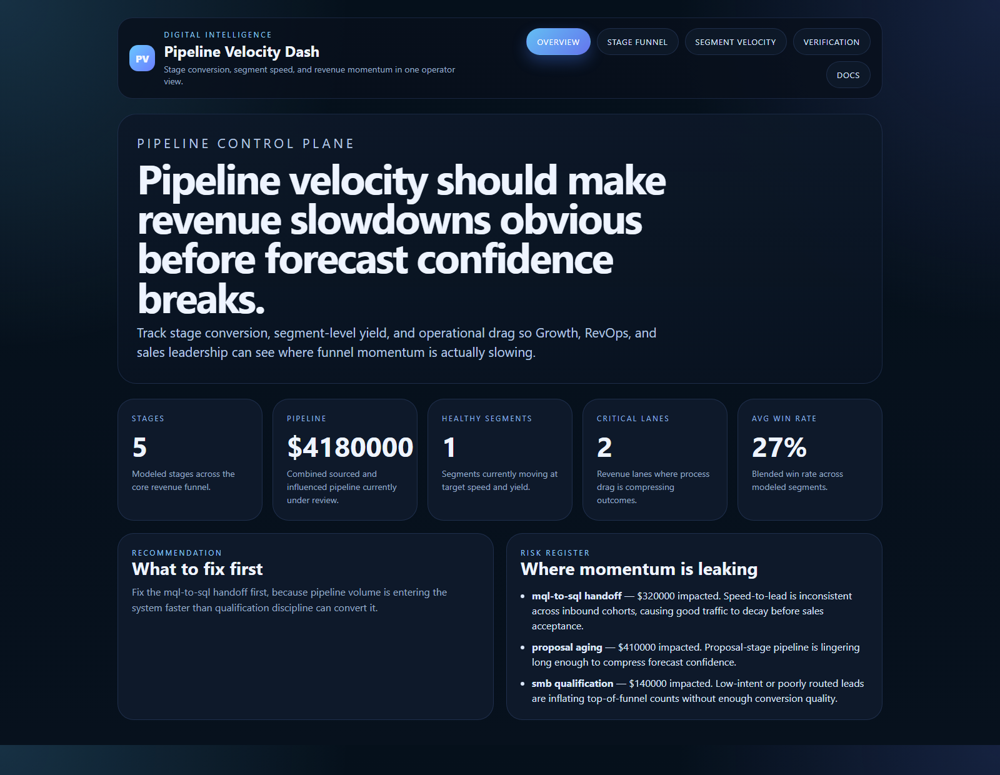
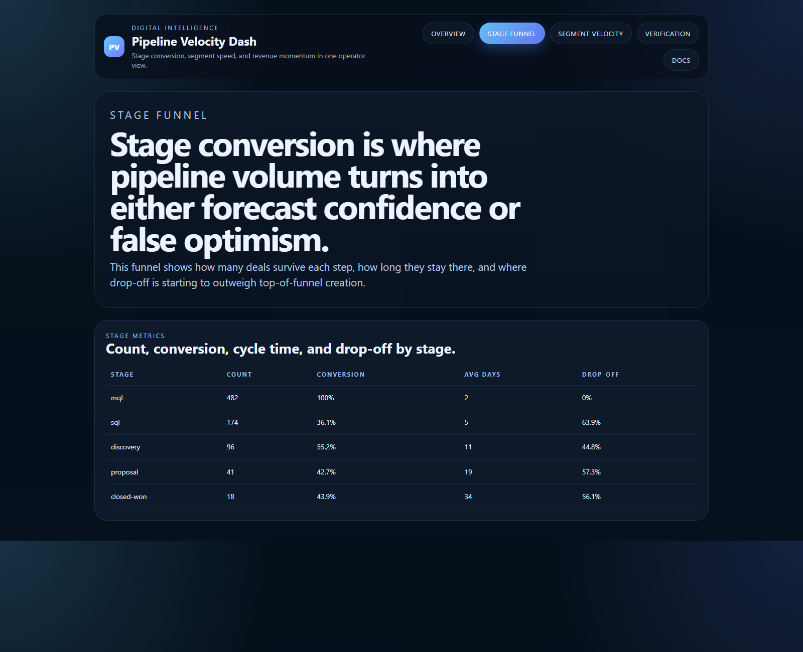
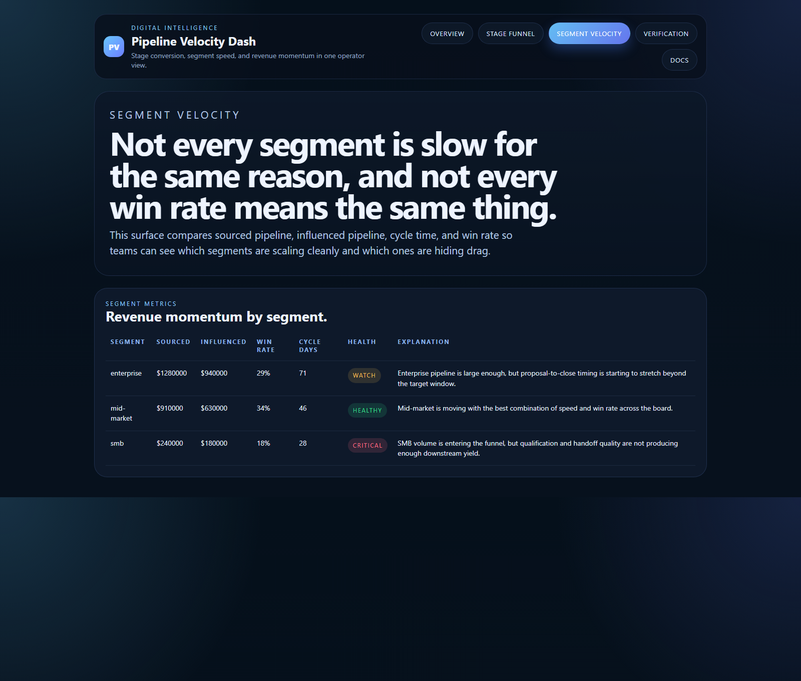
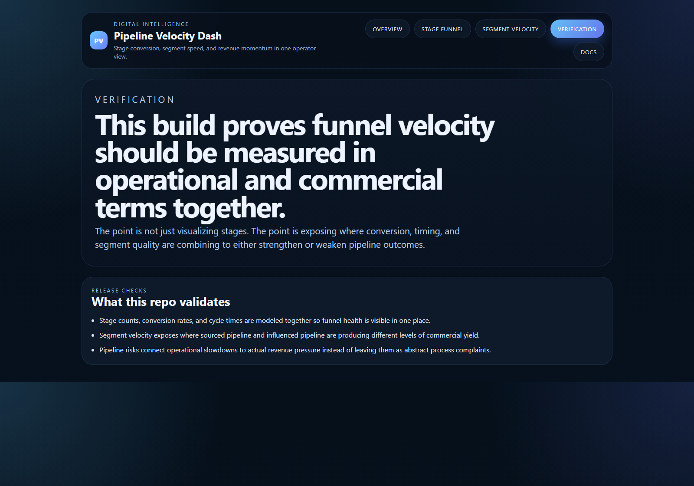

# Pipeline Velocity Dash

TypeScript dashboard for stage conversion, segment-level speed, sourced versus influenced pipeline, and revenue-momentum risk.

## Why this exists

Pipeline generation can look healthy while velocity quietly breaks:
- top-of-funnel volume rises but sales acceptance falls
- one segment moves fast while another drags forecast confidence down
- proposal-stage aging hides inside aggregate pipeline numbers
- sourced and influenced pipeline get mixed together until nobody trusts the dashboard

`pipeline-velocity-dash` keeps those dynamics visible in one operator-facing surface so Growth, RevOps, and sales leadership can see where momentum is slowing before revenue does.

## Routes

- `/`
- `/stage-funnel`
- `/segment-velocity`
- `/verification`
- `/docs`

## API

- `/api/dashboard/summary`
- `/api/stage-funnel`
- `/api/segment-velocity`
- `/api/risks`
- `/api/verification`
- `/api/sample`

## Screenshots






## Local Development

```powershell
cd pipeline-velocity-dash
npm install
npm run dev
```

Open:
- [http://127.0.0.1:5298/](http://127.0.0.1:5298/)
- [http://127.0.0.1:5298/stage-funnel](http://127.0.0.1:5298/stage-funnel)
- [http://127.0.0.1:5298/segment-velocity](http://127.0.0.1:5298/segment-velocity)
- [http://127.0.0.1:5298/verification](http://127.0.0.1:5298/verification)
- [http://127.0.0.1:5298/docs](http://127.0.0.1:5298/docs)

## Validation

- `npm run build`
- `npm run test`
- `npm run demo`
- `npm run smoke`
- `npm run render:assets`

## Docs

- [Architecture](./docs/architecture.md)
- [Origin](./docs/ORIGIN.md)
- [Changelog](./CHANGELOG.md)
